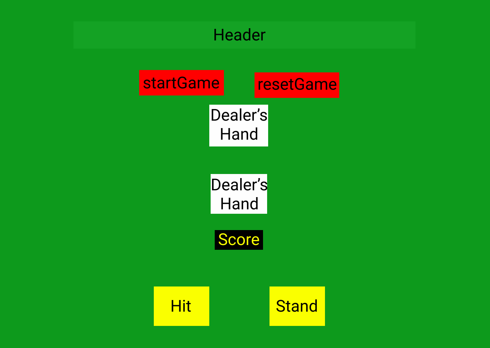
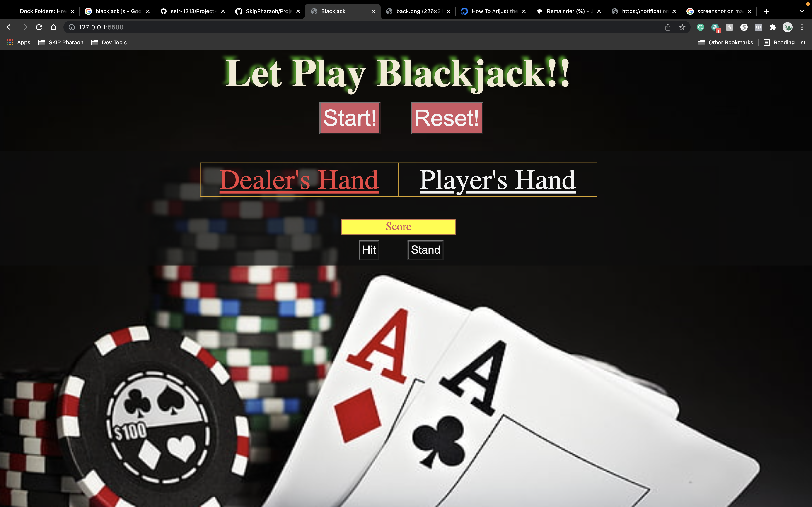
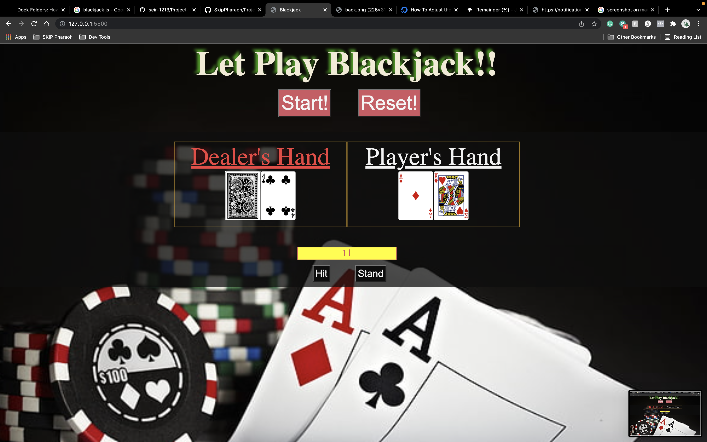
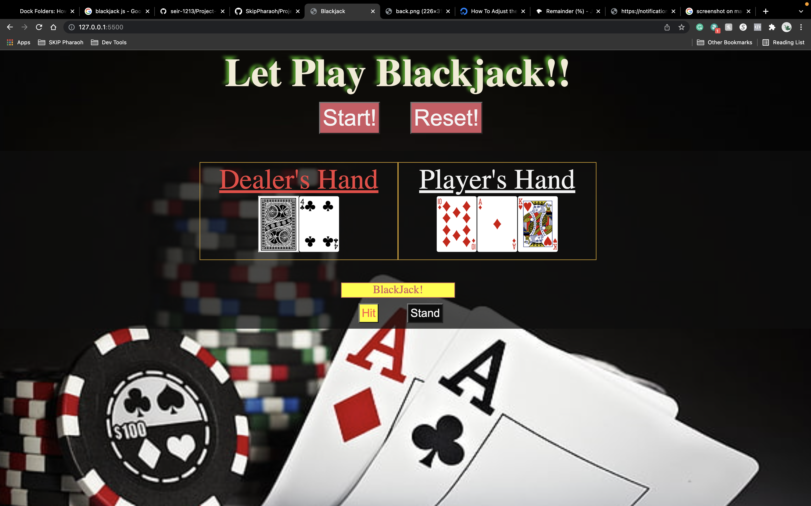
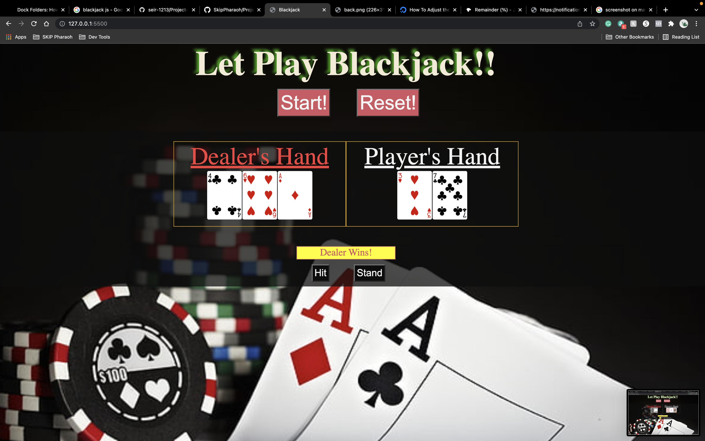

# Project-Blackjack

This a browser-based game, using mostly JavaScript. The project details can be found [here](https://git.generalassemb.ly/seir-1213/Project-1-Intro-Purple), while the actual game can be found [here!](https://skippharaoh.github.io/Project-Blackjack/).

# MVP Goal
    1) Title that tells people what game they are about to play.
    2) Have a game layout with areas for both dealer's hand & player's hand.
    3) A start button that deals 2 faceup cards to players & 1 faceup card with 1 facedown card.
    4) Reset button that removes all cards from the hands reshuffles the deck.
    5) Hit button the gives player one additional card.
    6) Stand button that ends player turn and start dealer turn. Also executes the dealer's move.
    7) A function that tracks the score of the player's hand & another function that tracks the dealer's hands.
    8) A function that decides who wins & informs player who wins.

## Card Rules

1) Ace is a special card, it can count as 1 point or 11 points depending on the other cards in a player hand. If a player draws an Ace and the points exceed 21, then the Ace will count as 1 point. If the player draws an Ace and the score does not exceed 21, then the Ace will count as 11.
2) Players cannot get any more cards after they reach 21 points or exceeds 21 points
3) During the starting phase, each player receives two cards facing up for everyone to see. However, the dealer has one card facing up and one card facing down for no one to see.
4) The Card Decks are shuffled before the start of the game.

## Blackjack Game Overview

Blackjack is a comparitive card game that can consist of 2 or more players and a dealer. This game is also know to some as twenty-one. Essentially each player competes against the dealer, however the players do not compete against each other players. The game consists of six standard 52 card decks. The main objective of Blackjack is to beat the dealer!

In order to complete the objective, players have one of three ways of doing so:
    1) Have a total of 21 points.
    2) Have a final score higher than the dealer without exceeding 21 points.
    3) The dealer exceeds 21 points.

In order to lose to the dealer in one of two ways:
    1) Player hand exceeds 21.
    2) The dealer has a greater value than the player at the end of the round.

Click [here](https://bicyclecards.com/how-to-play/blackjack/) for more info!

#### The Dealer's Go-To

The dealer will always stand if they have a total of 17 or more points. If the total points of the dealer is 16 or less, the dealer must continue to take cards until the total reachs 17 or more. This rule does not apply to other players!

# Wire-Frame

